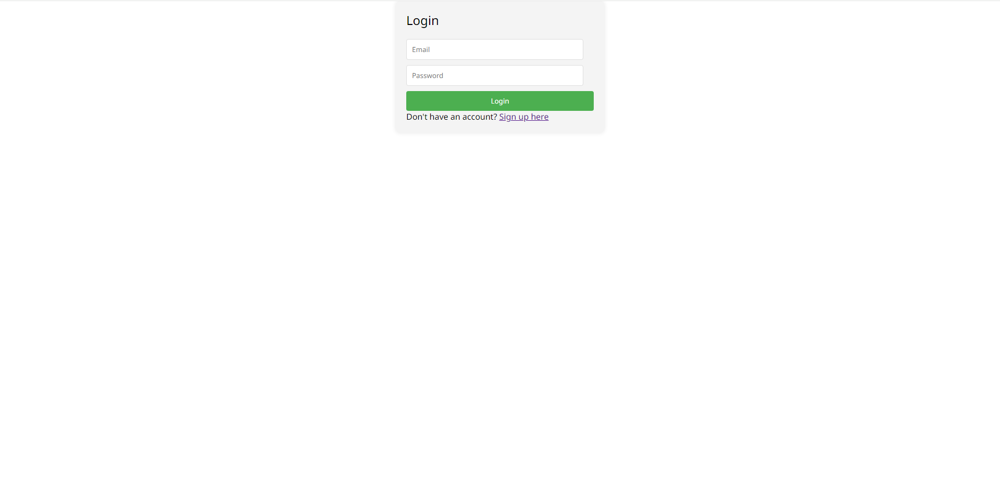
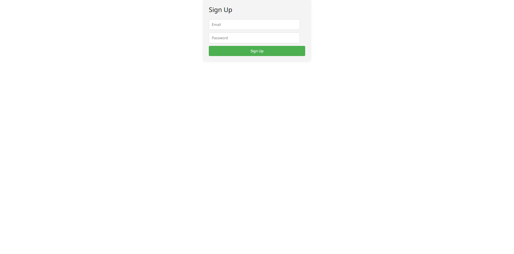
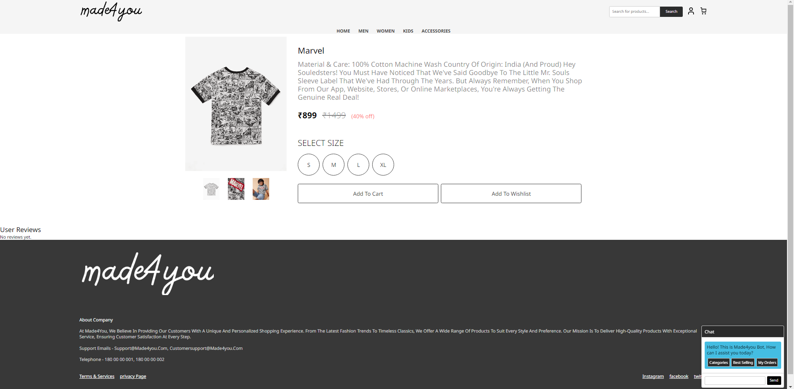
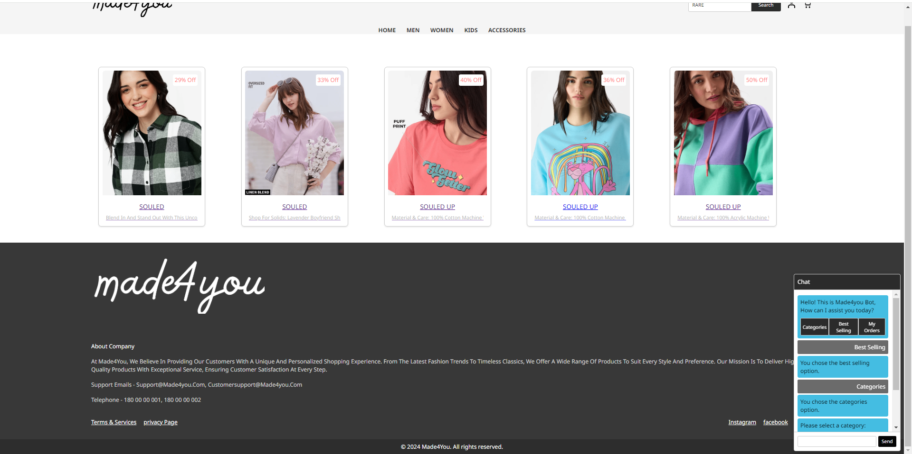
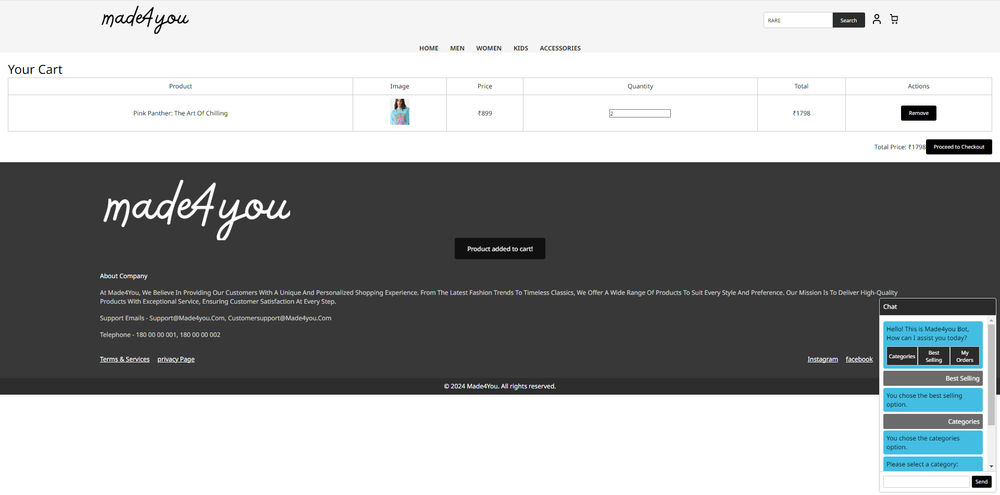
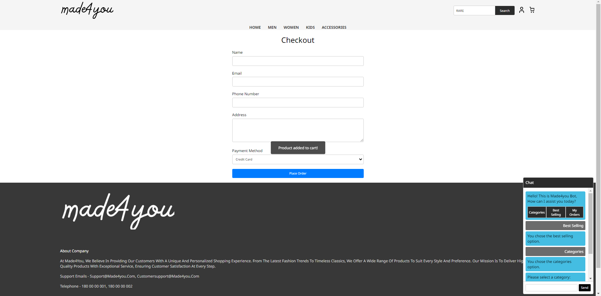
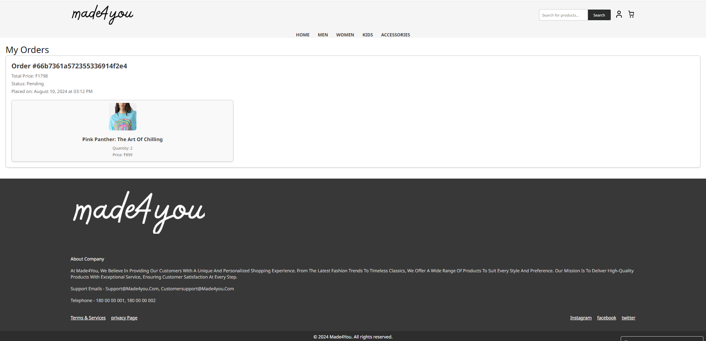
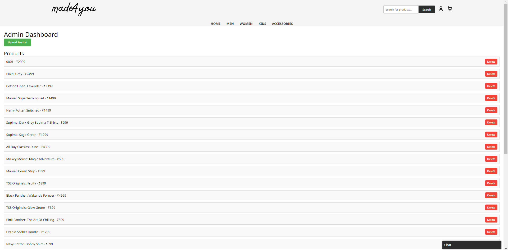
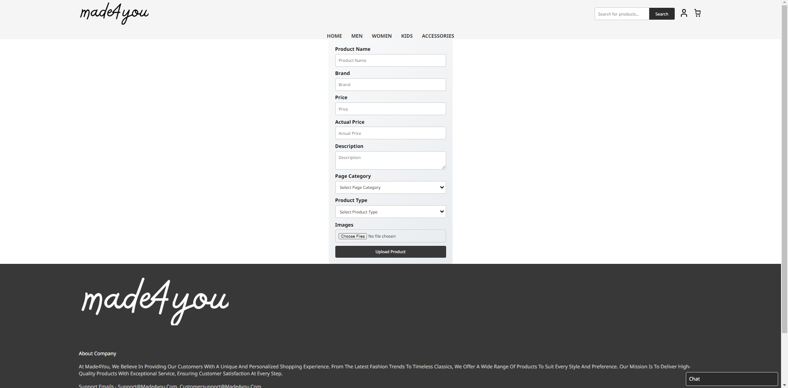

Made4you Website- by USN 221VMTR02545 - PRAMOD KUMAR V

Appendix A:

1. Terms and Conditions
   Limitations of Liability:
   • The "Made4You" project will not be liable for any damages arising from the use or inability to use the website.
   User Warranties:
   • Users warrant that they will not use the website for any unlawful purposes.
   Dispute Resolution:
   • Any disputes arising out of or relating to the use of the website shall be resolved through mutual agreement or academic mediation if required.
2. Privacy Policy
   Data Collection:
   • "Made4You" collects personal information such as names and email addresses when users create an account.
   Data Use:
   • Collected data is used to provide a better user experience and for project analysis.
   • User data is not shared with third parties.
   Data Disclosure:
   • User data may be disclosed in response to legal requests or to protect the rights and safety of "Made4You" and its users.
3. Return and Refund Policy
   (Since this is an academic project, this section can be simplified or omitted if not applicable)
4. Disclaimers
   Content Accuracy:
   • "Made4You" does not guarantee the accuracy or completeness of the information on the website.
5. Code of Conduct
   • Users must respect other members of the community and refrain from any form of harassment or abusive behaviour.
   • Users must not post any content that is illegal, offensive, or violates the rights of others.
6. Technical Specifications
   • The website supports the latest versions of major browsers (Chrome, Firefox, Safari, Edge).
   • The website is optimized for both desktop and mobile devices.
7. Data Security Policy
   • "Made4You" uses encryption and secure servers to protect user data.
   • Regular security audits are conducted to ensure the integrity of the website.
8. Intellectual Property Policy
   • All content on the website, including text, images, and logos, is the property of "Made4You" and is protected by copyright laws.
   • Users may not use any content from the website without written permission from "Made4You".
9. Licenses
   • Include any third-party licenses for software or code used in the website, such as open-source licenses for libraries or frameworks.

Appendix B: Sample API Endpoints

User Management:
• POST /api/users/signup: Registers a new user.
• POST /api/users/login: Authenticates a user.
• GET /api/users/profile: Fetches the user's profile.
• PUT /api/users/address: Updates the user's address.

Product Management:
• GET /api/products: Fetches all products.
• POST /api/products: Adds a new product.
• GET /api/products/:id: Fetches a specific product by ID.
• DELETE /api/products/:id: Deletes a product by ID.
• GET /api/products/search: Searches products based on a query.

Order Management:
• POST /api/orders: Places a new order.
• GET /api/orders: Fetches all orders (Admin only).
• GET /api/orders/user: Fetches orders for the logged-in user.
• DELETE /api/orders/:id: Deletes an order by ID.

Wishlist Management:
• POST /api/wishlist: Adds a product to the wishlist.
• GET /api/wishlist: Fetches the user's wishlist.
• DELETE /api/wishlist/:productId: Removes a product from the wishlist by product ID.

Appendix C: Installation Guide

MongoDB Installation:

1. Download MongoDB from mongodb.com.
2. Follow installation instructions for your operating system.
3. Start MongoDB service:
   macOS/Linux: brew services start mongodb/brew/mongodb-community
   Windows: net start MongoDB

Backend Installation:

1. Navigate to backend project directory.
2. Install dependencies:
   npm install
3. Start backend server:
   node server.js
   Frontend Installation:
4. Navigate to frontend project directory.
5. Install dependencies:
   npm install
6. Start frontend development server:
   npm start

Copyrights reserved by VPramod

## Screenshots

In the project directory, you can run:

### `npm start`

Runs the app in the development mode.\
Open [http://localhost:3000](http://localhost:3000) to view it in your browser.

The page will reload when you make changes.\
You may also see any lint errors in the console.

### `npm test`

Launches the test runner in the interactive watch mode.\
See the section about [running tests](https://facebook.github.io/create-react-app/docs/running-tests) for more information.

### `npm run build`

Builds the app for production to the `build` folder.\
It correctly bundles React in production mode and optimizes the build for the best performance.

The build is minified and the filenames include the hashes.\
Your app is ready to be deployed!

### `npm run eject`

**Note: this is a one-way operation. Once you `eject`, you can't go back!**
